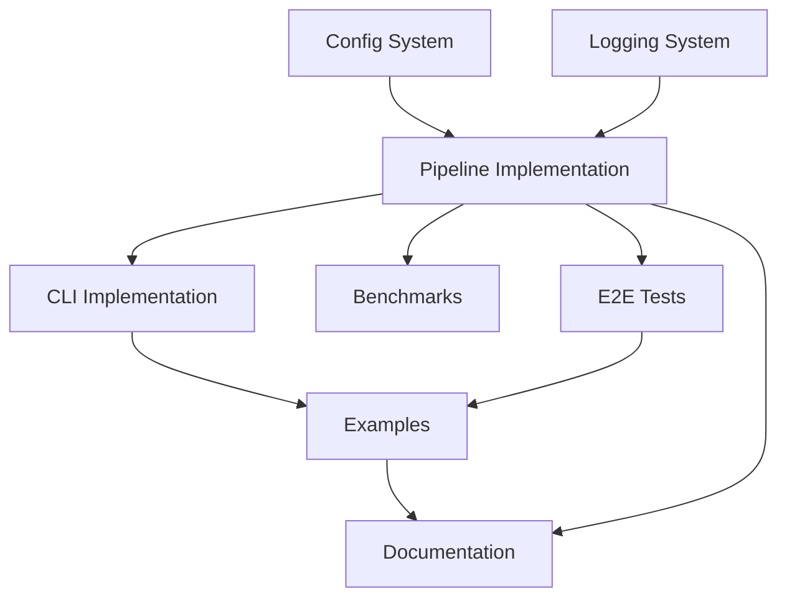

# Phase 6: Production Readiness - Execution Plan

**Status**: 📋 Ready for Implementation
**Phase**: 3 of Work Plan Protocol (Full Spec → Plan)
**Timeline**: 4-6 weeks

## Critical Path



**Critical Path Sequence**:
1. Config System (3 days) - needed by Pipeline
2. Pipeline Implementation (5 days) - core orchestration
3. CLI Implementation (5 days) - depends on Pipeline
4. Examples (4 days) - depends on Pipeline + CLI
5. Documentation (8 days) - depends on all above

**Total Critical Path**: ~25 days (~5 weeks)

---

## Task Ordering & Dependencies

### Week 1: Foundation (Days 1-5)

#### Stream A: Configuration & Logging (Parallel)
**Tasks**:
- [ ] `maze-ph6.1.1` - Implement Config dataclasses
- [ ] `maze-ph6.1.2` - Implement TOML loading/saving
- [ ] `maze-ph6.1.3` - Implement config merging (global → project → CLI)
- [ ] `maze-ph6.1.4` - Config validation
- [ ] `maze-ph6.1.5` - Config tests (35 tests)
- [ ] `maze-ph6.2.1` - Implement StructuredLogger
- [ ] `maze-ph6.2.2` - Implement MetricsCollector
- [ ] `maze-ph6.2.3` - Logging tests (20 tests)

**Assignee**: Can be done in parallel
**Duration**: 3 days
**Output**: `maze/config.py`, `maze/logging.py`, tests

---

#### Stream B: Pipeline Core (Critical Path)
**Tasks**:
- [ ] `maze-ph6.3.1` - Design Pipeline interface (typed holes)
- [ ] `maze-ph6.3.2` - Implement PipelineConfig dataclass
- [ ] `maze-ph6.3.3` - Implement Pipeline.index_project()
- [ ] `maze-ph6.3.4` - Implement Pipeline.generate()
- [ ] `maze-ph6.3.5` - Implement Pipeline.validate()
- [ ] `maze-ph6.3.6` - Implement Pipeline.repair()
- [ ] `maze-ph6.3.7` - Pipeline unit tests (20 tests)

**Dependencies**: Config (maze-ph6.1.x)
**Duration**: 5 days
**Output**: `maze/core/pipeline.py`, tests

---

### Week 2: Integration & CLI (Days 6-10)

#### Stream A: External Integrations
**Tasks**:
- [ ] `maze-ph6.4.1` - ExternalIntegrations interface
- [ ] `maze-ph6.4.2` - Pedantic Raven mock integration
- [ ] `maze-ph6.4.3` - RUNE mock integration
- [ ] `maze-ph6.4.4` - Graceful degradation tests
- [ ] `maze-ph6.4.5` - Integration tests (13 tests)

**Dependencies**: Pipeline (maze-ph6.3.x)
**Duration**: 3 days
**Output**: `maze/integrations/external.py`, tests

---

#### Stream B: CLI Implementation (Critical Path)
**Tasks**:
- [ ] `maze-ph6.5.1` - CLI framework setup (argparse)
- [ ] `maze-ph6.5.2` - InitCommand implementation
- [ ] `maze-ph6.5.3` - ConfigCommand implementation
- [ ] `maze-ph6.5.4` - IndexCommand implementation
- [ ] `maze-ph6.5.5` - GenerateCommand implementation
- [ ] `maze-ph6.5.6` - ValidateCommand implementation
- [ ] `maze-ph6.5.7` - StatsCommand implementation
- [ ] `maze-ph6.5.8` - DebugCommand implementation
- [ ] `maze-ph6.5.9` - CLI unit tests (40 tests)
- [ ] `maze-ph6.5.10` - CLI integration tests (10 tests)

**Dependencies**: Pipeline (maze-ph6.3.x), Config (maze-ph6.1.x)
**Duration**: 5 days
**Output**: `maze/cli/`, tests, `maze` CLI entry point

---

### Week 3: Testing & Benchmarks (Days 11-15)

#### Stream A: E2E Tests
**Tasks**:
- [ ] `maze-ph6.6.1` - E2E test framework setup
- [ ] `maze-ph6.6.2` - Full pipeline E2E tests (10 tests)
- [ ] `maze-ph6.6.3` - CLI workflow E2E tests (10 tests)
- [ ] `maze-ph6.6.4` - Multi-provider E2E tests (4 tests)
- [ ] `maze-ph6.6.5` - Validation + repair E2E tests (5 tests)
- [ ] `maze-ph6.6.6` - Learning feedback E2E tests (5 tests)

**Dependencies**: Pipeline (maze-ph6.3.x), CLI (maze-ph6.5.x)
**Duration**: 4 days
**Output**: `tests/e2e/test_phase6.py` (34 E2E tests)

---

#### Stream B: Performance Benchmarks
**Tasks**:
- [ ] `maze-ph6.7.1` - Select 3 real-world projects
- [ ] `maze-ph6.7.2` - Benchmark framework setup
- [ ] `maze-ph6.7.3` - Small project benchmarks (1K-5K LOC)
- [ ] `maze-ph6.7.4` - Medium project benchmarks (10K-50K LOC)
- [ ] `maze-ph6.7.5` - Large project benchmarks (100K+ LOC)
- [ ] `maze-ph6.7.6` - Stress testing suite
- [ ] `maze-ph6.7.7` - Profiling analysis (CPU, memory)
- [ ] `maze-ph6.7.8` - Performance report generation

**Dependencies**: Pipeline (maze-ph6.3.x)
**Duration**: 4 days
**Output**: `benchmarks/phase6/`, performance report

---

### Week 4: Examples & Documentation (Days 16-20)

#### Stream A: Examples (Critical Path)
**Tasks**:
- [ ] `maze-ph6.8.1` - Basic example 1: Function generation
- [ ] `maze-ph6.8.2` - Basic example 2: Class generation
- [ ] `maze-ph6.8.3` - Basic example 3: Interface generation
- [ ] `maze-ph6.8.4` - Basic example 4: API endpoint
- [ ] `maze-ph6.8.5` - Basic example 5: Type-safe refactor
- [ ] `maze-ph6.8.6` - Advanced example 1: API generation with OpenAPI
- [ ] `maze-ph6.8.7` - Advanced example 2: Code refactoring
- [ ] `maze-ph6.8.8` - Advanced example 3: Test generation
- [ ] `maze-ph6.8.9` - Advanced example 4: Documentation generation
- [ ] `maze-ph6.8.10` - Example tests (13 tests)

**Dependencies**: Pipeline (maze-ph6.3.x), CLI (maze-ph6.5.x)
**Duration**: 4 days
**Output**: `examples/` directory with working examples

---

#### Stream B: User Guide (Parallel with Examples)
**Tasks**:
- [ ] `maze-ph6.9.1` - Getting Started tutorial
- [ ] `maze-ph6.9.2` - Core Concepts documentation
- [ ] `maze-ph6.9.3` - Tutorial 1: TypeScript API endpoint
- [ ] `maze-ph6.9.4` - Tutorial 2: Type-safe refactoring
- [ ] `maze-ph6.9.5` - Tutorial 3: Project-specific patterns
- [ ] `maze-ph6.9.6` - Best Practices guide

**Dependencies**: Examples (maze-ph6.8.x)
**Duration**: 4 days
**Output**: `docs/user-guide/` markdown files

---

### Week 5: Documentation & Polish (Days 21-25)

#### Stream A: API Reference
**Tasks**:
- [ ] `maze-ph6.10.1` - Configure Sphinx/mkdocs
- [ ] `maze-ph6.10.2` - Generate API docs for maze.core
- [ ] `maze-ph6.10.3` - Generate API docs for maze.indexer
- [ ] `maze-ph6.10.4` - Generate API docs for maze.synthesis
- [ ] `maze-ph6.10.5` - Generate API docs for maze.orchestrator
- [ ] `maze-ph6.10.6` - Generate API docs for maze.validation
- [ ] `maze-ph6.10.7` - Generate API docs for maze.repair
- [ ] `maze-ph6.10.8` - Generate API docs for maze.learning
- [ ] `maze-ph6.10.9` - Generate API docs for maze.integrations
- [ ] `maze-ph6.10.10` - Test all API examples (doctest)

**Dependencies**: None (uses existing code)
**Duration**: 3 days
**Output**: Auto-generated API docs

---

#### Stream B: Integration Guides
**Tasks**:
- [ ] `maze-ph6.11.1` - OpenAI provider setup guide
- [ ] `maze-ph6.11.2` - vLLM provider setup guide
- [ ] `maze-ph6.11.3` - SGLang provider setup guide
- [ ] `maze-ph6.11.4` - llama.cpp provider setup guide
- [ ] `maze-ph6.11.5` - Docker deployment guide
- [ ] `maze-ph6.11.6` - Kubernetes deployment guide
- [ ] `maze-ph6.11.7` - CI/CD integration examples

**Dependencies**: CLI (maze-ph6.5.x)
**Duration**: 3 days
**Output**: `docs/integration-guides/` markdown files

---

#### Stream C: Architecture Guide
**Tasks**:
- [ ] `maze-ph6.12.1` - System overview diagrams
- [ ] `maze-ph6.12.2` - Component deep dives
- [ ] `maze-ph6.12.3` - Extension points documentation
- [ ] `maze-ph6.12.4` - Design decisions documentation

**Dependencies**: None (documents existing system)
**Duration**: 2 days
**Output**: `docs/architecture/` markdown files

---

### Week 6: Optional Enhancements (Days 26-30)

**Tasks** (prioritize based on time):
- [ ] `maze-ph6.13.1` - Integration example: GitHub bot
- [ ] `maze-ph6.13.2` - Integration example: CI pipeline
- [ ] `maze-ph6.13.3` - Integration example: IDE plugin prototype
- [ ] `maze-ph6.13.4` - Video tutorial (getting started)
- [ ] `maze-ph6.13.5` - Blog post / case study
- [ ] `maze-ph6.13.6` - Performance optimization (if bottlenecks found)

**Dependencies**: All previous work complete
**Duration**: 5 days (buffer for polish and extras)

---

## Parallelization Opportunities

### Week 1
- **Parallel**: Config (A) + Pipeline (B)
- **Parallel**: Logging (A) can be done anytime

### Week 2
- **Parallel**: External Integrations (A) + CLI (B)

### Week 3
- **Parallel**: E2E Tests (A) + Benchmarks (B)

### Week 4
- **Parallel**: Examples (A) + User Guide (B)

### Week 5
- **Parallel**: API Reference (A) + Integration Guides (B) + Architecture Guide (C)

**Maximum Parallelism**: Up to 3 concurrent work streams in Week 5

---

## Milestones

### Milestone 1: Foundation Complete (End of Week 1)
- ✅ Config system working
- ✅ Logging system working
- ✅ Pipeline core implemented
- ✅ 75 unit tests passing
- **Deliverable**: `maze.Pipeline` usable via Python API

### Milestone 2: CLI Ready (End of Week 2)
- ✅ All CLI commands implemented
- ✅ External integrations working
- ✅ 128 total new tests passing
- **Deliverable**: `maze` CLI usable from command line

### Milestone 3: Testing Complete (End of Week 3)
- ✅ E2E tests passing (34 tests)
- ✅ Benchmarks run successfully
- ✅ Performance report generated
- ✅ 162 total new tests passing
- **Deliverable**: Validated system performance

### Milestone 4: Examples Working (End of Week 4)
- ✅ 9 examples working end-to-end
- ✅ User guide with 3 tutorials
- ✅ 175 total new tests passing
- **Deliverable**: Users can follow tutorials successfully

### Milestone 5: Docs Complete (End of Week 5)
- ✅ API reference published
- ✅ Integration guides complete
- ✅ Architecture guide complete
- **Deliverable**: Complete documentation suite

### Milestone 6 (Optional): Production Polish (End of Week 6)
- ✅ Advanced integration examples
- ✅ Video tutorial
- ✅ Performance optimizations applied
- **Deliverable**: Production-ready system

---

## Resource Allocation

### If Solo Developer
**Recommended Approach**: Follow critical path strictly
- Week 1: Config + Pipeline (focus on critical path)
- Week 2: CLI (critical path)
- Week 3: E2E Tests (critical path) + Benchmarks when possible
- Week 4: Examples (critical path) + User Guide
- Week 5: API Reference + select integration guides
- Week 6: Buffer and polish

**Estimated Time**: 5-6 weeks full-time

### If Team (2-3 developers)
**Recommended Split**:
- Developer 1: Critical path (Pipeline → CLI → Examples)
- Developer 2: Config + Logging → E2E Tests → Benchmarks
- Developer 3: Documentation (User Guide → API Ref → Integration Guides)

**Estimated Time**: 3-4 weeks

---

## Risk Management

### High-Priority Risks

| Risk | Mitigation | Contingency |
|------|------------|-------------|
| Pipeline complexity exceeds estimate | Start simple, iterate | Reduce scope to TypeScript-only |
| Benchmark projects too large | Use smaller real-world projects | Synthetic benchmarks OK |
| Documentation scope creep | Focus on user-facing docs first | Defer advanced topics |
| E2E tests flaky | Use retry logic, increase timeouts | Accept some flakiness initially |
| Performance bottlenecks | Profile early, optimize iteratively | Document limitations clearly |

### Medium-Priority Risks

| Risk | Mitigation | Contingency |
|------|------------|-------------|
| CLI design bikeshedding | Follow established patterns (git, npm) | User feedback post-launch |
| Example complexity | Start simple, add complexity gradually | Fewer complex examples OK |
| External integration failures | Mock all external services | Document integration as optional |

---

## Testing Strategy

### Test Pyramid
```
        /\
       /  \  E2E Tests (54 tests)
      /____\
     /      \
    / Integr \  Integration Tests (37 tests)
   /__________\
  /            \
 /   Unit Tests \ (115 tests)
/________________\
```

**Total New Tests**: ~172
**Combined with existing**: 728 + 172 = **900 tests**

### Continuous Integration
- Run unit tests on every commit
- Run integration tests on PR
- Run E2E tests nightly
- Run benchmarks weekly

---

## Definition of Done

### For Each Task
- [ ] Implementation complete
- [ ] Unit tests written and passing
- [ ] Integration tests passing (if applicable)
- [ ] Code reviewed (self-review minimum)
- [ ] Documentation updated (docstrings, guides)
- [ ] Committed to git with clear message

### For Each Milestone
- [ ] All milestone tasks complete
- [ ] All tests passing
- [ ] No critical bugs
- [ ] Deliverable works end-to-end
- [ ] Documentation updated

### For Phase 6 Complete
- [ ] All milestones achieved
- [ ] 900+ tests passing
- [ ] 0 critical bugs
- [ ] Documentation complete and reviewed
- [ ] Performance targets validated
- [ ] Examples working
- [ ] CLI fully functional
- [ ] Docker deployment tested
- [ ] README updated with Phase 6 status

---

## Next Actions

Following Work Plan Protocol Phase 4 (Plan → Artifacts):

1. **Immediate**: Start with `maze-ph6.1.1` (Config dataclasses)
2. **Use TodoWrite**: Track all tasks in todo list
3. **Commit frequently**: After each logical unit of work
4. **Test early**: Run tests after each commit
5. **Update plan**: Mark tasks complete as you go

**First Sprint** (Week 1, Days 1-5):
```bash
# Day 1-2: Config system
maze-ph6.1.1 → maze-ph6.1.2 → maze-ph6.1.3 → maze-ph6.1.4 → maze-ph6.1.5

# Day 3-5: Pipeline core
maze-ph6.3.1 → maze-ph6.3.2 → maze-ph6.3.3 → maze-ph6.3.4 →
maze-ph6.3.5 → maze-ph6.3.6 → maze-ph6.3.7

# Parallel (if possible): Logging
maze-ph6.2.1 → maze-ph6.2.2 → maze-ph6.2.3
```

---

## Tracking Progress

### Weekly Check-ins
- Monday: Review week's tasks, identify blockers
- Wednesday: Mid-week progress check
- Friday: Complete milestone checklist, plan next week

### Tools
- **TodoWrite**: Track current tasks
- **Git commits**: Track completion (reference task IDs in commits)
- **Test runs**: Track quality (aim for all green)
- **This document**: Update task checkboxes as completed

---

## Success Metrics

### Quantitative
- ✅ 900+ tests passing
- ✅ <10s end-to-end generation time
- ✅ <2GB memory for 100K LOC
- ✅ >70% cache hit rate
- ✅ 100% of examples working
- ✅ 100% of API docs generated

### Qualitative
- ✅ User can follow tutorials successfully
- ✅ CLI feels intuitive and helpful
- ✅ Documentation answers common questions
- ✅ System handles errors gracefully
- ✅ Performance meets expectations

---

**Ready to begin implementation. Following Work Plan Protocol Phase 4.**
